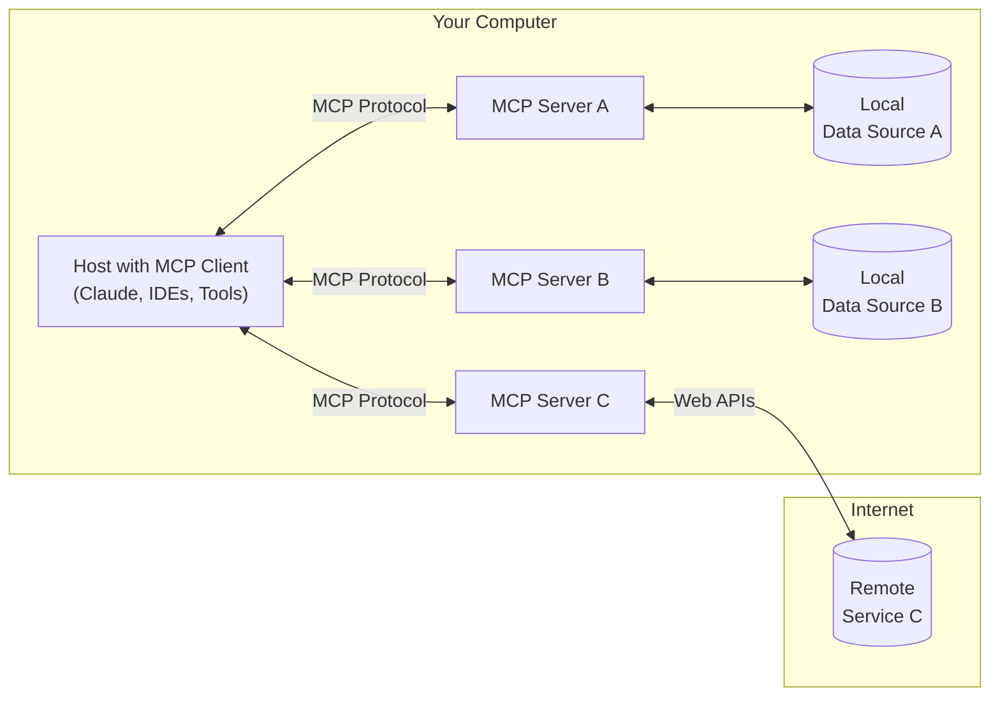

What is MCP?
===

- [Model Context Protocal](https://modelcontextprotocol.io/introduction)
- An open protocol that standardizes how applications provide context to LLMs.
- Developed by Anthropic, the company develops Claude

<!-- end_slide -->

Why do people use MCP?
===

- Build agents and complex workflows on top of LLMs
- MCP provides (from the official document):
    - A growing list of pre-built integrations that your LLM can directly plug into
    - The flexibility to switch between LLM providers and vendors
    - Best practices for securing your data within your infrastructure

<!-- end_slide -->

What are defined in MCP?
===

- tools: executable functionality that can be called by clients
- resources: data and content that can be read by clients and used as context for LLM interactions
- prompts: reusable prompt templates and workflows that clients can easily surface to users and LLMs

<!-- end_slide -->

MCP architecture
===



- You need a MCP server and a client
- Server can run locally or remotely
- Client may not support all functionality

<!-- end_slide -->

Using MCP server in VSCode
===

# Prerequisite:

- Install VSCode > v1.99.3
- Enable copilot and login

---

# Clone this example repository

```bash +exec
cd $(mktemp -d)
git clone https://github.com/appolloford/mcptests.git
code mcptests
```

<!-- end_slide -->

Using MCP server in VSCode (continue)
===

# Open copilot tab
- Select `Agent` mode
- Start ask questions. E.g. How can I get an account on Vera

<!-- end_slide -->

Editing MCP config file
===

```json
{
    "servers": {
        // ...
        "c3se": {
            "type": "stdio",
            "command": "uv",
            "args": [
                "--directory",
                "${workspaceFolder}/src/server",
                "run",
                "c3se.py"
            ]
        },
        // ...
        // "weather": {
        //     "command": "uv",
        //     "args": [
        //         "--directory",
        //         "${workspaceFolder}/src/server",
        //         "run",
        //         "weather.py"
        //     ]
        // }
    }
}

```

<!-- end_slide -->

Convert local LLM to Agent by using `mcphost`
===

# Prerequisite:

- Install Ollama and pull a supported model (e.g. llama3.2)

## On Mac
```bash +exec
brew install go
go install github.com/mark3labs/mcphost@latest
$HOME/go/bin/mcphost -m ollama:llama3.2 --config mcp.json
```

<!-- end_slide -->

Create your own MCP server
===

<!-- end_slide -->

Make your own local MCP client (Ollama)
===

<!-- end_slide -->

Make your own local MCP client (vllm)
===


<!-- end_slide -->

Reference:
===
- [Offical website](https://modelcontextprotocol.io/introduction)
- [Journey from Function calling to MCP](https://medium.com/@mustangs007/journey-from-function-calling-to-mcp-model-context-protocol-in-llms-ee615d670cd5)

<!-- end_slide -->

Next ?
===
- [A2A](https://github.com/google/A2A)

