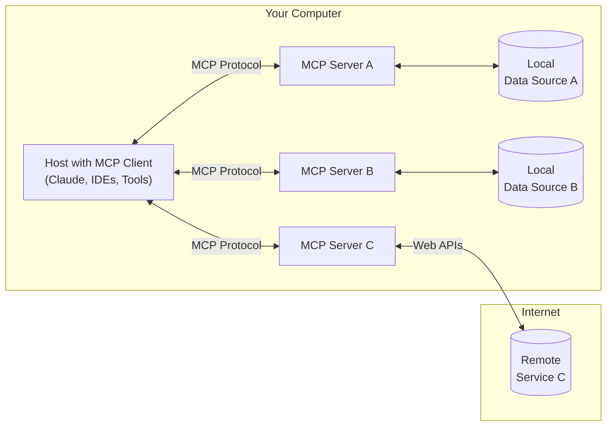

What is MCP?
===

- [Model Context Protocal](https://modelcontextprotocol.io/introduction)
- An open protocol that standardizes how applications provide context to LLMs.
- Developed by Anthropic, the company develops Claude

<!-- end_slide -->

Why do people use MCP?
===

- Build agents and complex workflows on top of LLMs
- MCP provides (from the official document):
    - A growing list of pre-built integrations that your LLM can directly plug into
    - The flexibility to switch between LLM providers and vendors
    - Best practices for securing your data within your infrastructure

<!-- end_slide -->

What are defined in MCP?
===

- tools: executable functionality that can be called by clients
- resources: data and content that can be read by clients and used as context for LLM interactions
- prompts: reusable prompt templates and workflows that clients can easily surface to users and LLMs

<!-- end_slide -->

MCP architecture
===

<!-- column_layout: [3, 2] -->

<!-- column: 0 -->


<!-- alignment: center -->
Source: [Model Context Protocal](https://modelcontextprotocol.io/introduction)
<!-- alignment: left -->


<!-- column: 1 -->

- You need a MCP server and a client
- Server can run locally or remotely
- Client may not support all functionality

<!-- reset_layout -->

<!-- end_slide -->

Using MCP server in VSCode
===

# Prerequisite:

- Install VSCode > v1.99.3
- Enable copilot and login

---

# Clone this example repository

```bash
git clone https://github.com/appolloford/mcptests.git
cd mcptests
touch .env # save API keys or customized environment variables
```

<!-- end_slide -->

Using MCP server in VSCode (continue)
===

# Create python venv

<!-- column_layout: [1, 1] -->

<!-- column: 0 -->

## Using venv
```bash
python -m venv .venv
source .venv/bin/activate
pip install uv
pip install -e .
```

<!-- column: 1 -->

## Using `uv`
```bash
uv venv
uv pip install -e .
```

<!-- reset_layout -->

# Open the repository with VSCode

```bash
code .
```

# Open copilot tab

- Select `Agent` mode and choose a model you prefer
- Start ask questions. E.g. How can I get an account on Vera

<!-- end_slide -->

Enable / disable your MCP servers
===

# `.vscode/mcp.json`

<!-- column_layout: [1, 1] -->

<!-- column: 0 -->

```json
{
    "servers": {
        // ...
        "c3se": {
            "type": "stdio",
            "command": "uv",
            "args": [
                "--directory",
                "${workspaceFolder}/src/server",
                "run",
                "c3se.py"
            ]
        },
        // ...
    }
}

```

<!-- column: 1 -->

## If you don't have `uv` installed

```json
{
    "servers": {
        // ...
        "c3se": {
            "type": "stdio",
            "command": "python",
            "args": [
                "${workspaceFolder}/src/server/c3se.py"
            ]
        },
        // ...
    }
}

```

<!-- reset_layout -->

<!-- end_slide -->

Build you local LLM Agent with `mcphost`
===

# Prerequisite:

- Install Ollama and pull a supported model (e.g. llama3.2)
- Install golang and `mcphost`. For example, on Mac

---

```bash
brew install go
go install github.com/mark3labs/mcphost@latest
```

# Launch ollama with MCP

```bash
sed "s|\${workspaceFolder}|$(pwd)|g" .vscode/mcp.json > config.json
OLLAMA_CONTEXT_LENGTH=16384 $HOME/go/bin/mcphost -m ollama:llama3.2 --config config.json
```

- Replace `${workspaceFolder}` in `.vscode/mcp.json` with the real path
- Same file can be used in other client, e.g., Claude Desktop

<!-- end_slide -->

Make your own MCP server
===

# A minimal example of MCP server
```python
from mcp.server.fastmcp import FastMCP
import math

# instantiate an MCP server client
mcp = FastMCP("Hello World")

# DEFINE TOOLS

# sin tool
@mcp.tool()
def sin(a: int) -> float:
    """sin of a number"""
    return float(math.sin(a))

# execute and return the stdio output
if __name__ == "__main__":
    mcp.run(transport="stdio")
```


<!-- end_slide -->

Make your own local MCP client (Ollama)
===

# `src/client/ollama_weather_client.py`

```python
from langchain_mcp_adapters.tools import load_mcp_tools
from langgraph.prebuilt import create_react_agent
from langchain_ollama import ChatOllama

class MCPClient:
    def __init__(self):
        ...
        self.session: Optional[ClientSession] = None
        self.model = ChatOllama(model="llama3.2")

    async def connect_to_server(self, server_script_path: str):
        # launch a server session and connect this client session to it

    async def process_query(self, query: str) -> str:
        available_tools = await load_mcp_tools(self.session)
        agent = create_react_agent(self.model, available_tools)
        response = await agent.ainvoke(messages)
        ...
```

- Similar to the official weather client example
- Using `ChatOllama` from `langchain` instead of `Anthropic`

<!-- end_slide -->

Make your own local MCP client (vllm)
===

# `src/client/vllm_weather_client.py`

```python
from langchain_mcp_adapters.tools import load_mcp_tools
from langgraph.prebuilt import create_react_agent
from langchain_openai import ChatOpenAI

class MCPClient:
    def __init__(self):
        ...
        self.session: Optional[ClientSession] = None
        self.model = ChatOpenAI(
            model=os.environ.get("HF_MODEL"),
            openai_api_key="EMPTY",
            openai_api_base="http://localhost:8000/v1",
        )

```

- Use `ChatOpenAI` instead
- LLM has to be started beforehand: 
- `vllm serve $HF_MODEL --enable-auto-tool-choice --tool-call-parser llama3_json`

<!-- end_slide -->

Reference:
===

- [Offical website](https://modelcontextprotocol.io/introduction)
- [mcphost](https://pkg.go.dev/github.com/mark3labs/mcphost)
- [LangChain Chat Models](https://python.langchain.com/docs/integrations/chat/)
- [Best MCP Servers You Should Know](https://medium.com/data-science-in-your-pocket/best-mcp-servers-you-should-know-019226d01bca)
- [Journey from Function calling to MCP](https://medium.com/@mustangs007/journey-from-function-calling-to-mcp-model-context-protocol-in-llms-ee615d670cd5)

<!-- end_slide -->

Next?
===

- [A2A](https://github.com/google/A2A)

<!-- end_slide -->

Co-perspective: MCP for AI/ML projects
===

- EoI for a project to extract synthesis parameters/experimental settings that optimize a material with regards to a specific characteristic from publications
  - state-of-the-art at the time used RAG
  - MCP could have advantages like continuous integration of new results and no need to put publication paragraphs into a vector database

- BioMCP: a specialized Model Context Protocol (MCP) server that connects AI assistants like Claude to biomedical data sources, including ClinicalTrials.gov, PubMed, and MyVariant.info.

<!-- end_slide -->

Co-perspective II: Some more thoughts
===

- ML pipelines as tools
  - we often don't trust LLMs because of hallucinations and it might not be efficient to prediction tasks to the LLM
  - MCP could use pre-implemented, tested pipelines as tools such that we get their result while allowing easy interaction with the pipeline and presentation of the results

- Data privacy?

